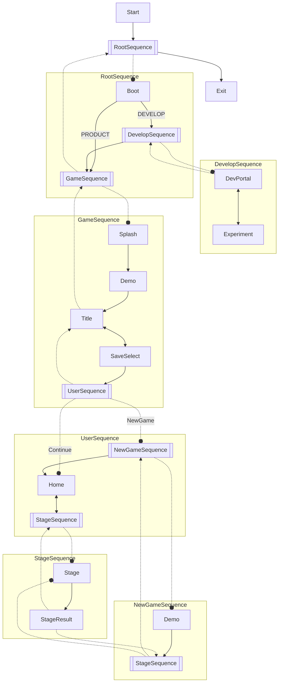

```mermaid
graph TD

Start --> RootSeq[[RootSequence]]
RootSeq --> Exit
RootSeq -.-o Boot

subgraph RootSequence
    Boot --> |DEVELOP|DevSeq[[DevelopSequence]]
    Boot --> |PRODUCT|GameSeq[[GameSequence]]
    DevSeq --> GameSeq
end
DevSeq -.-o DevPortal
DevPortal -.-> DevSeq
GameSeq -.-o Splash
GameSeq -.-> RootSeq

subgraph DevelopSequence
    DevPortal <--> Experiment
end

subgraph GameSequence
    Splash --> Demo
    Demo --> Title
    Title -.-> GameSeq
    Title <--> SaveSelect
    SaveSelect --> UserSeq[[UserSequence]]
end
UserSeq -.-> Title
UserSeq -.-o |NewGame|NewGameSeq[[NewGameSequence]]
UserSeq -.-o |Continue|Home

subgraph UserSequence
    Home <--> StageSeq[[StageSequence]]
    NewGameSeq --> Home
end
NewGameSeq -.-o Demo_2[Demo]
StageSeq -.-o Stage

subgraph StageSequence
    Stage --> StageResult
end
StageResult -.-> StageSeq

subgraph NewGameSequence
    Demo_2 --> StageSeq_2[[StageSequence]]
end
StageSeq_2 -.-> NewGameSeq
StageSeq_2 -.-o Stage
StageResult -.-> StageSeq_2
``` 